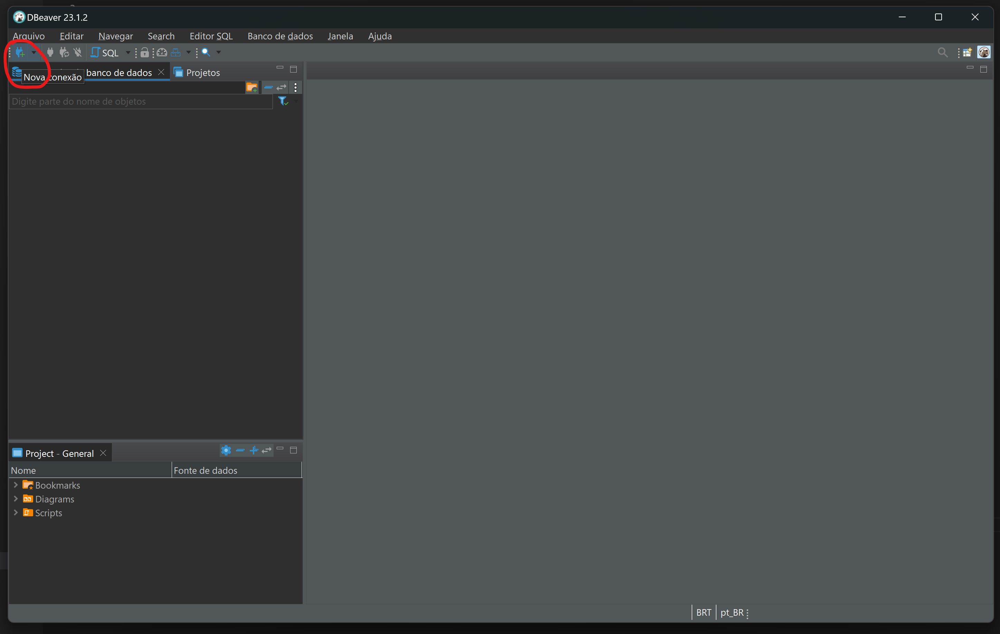
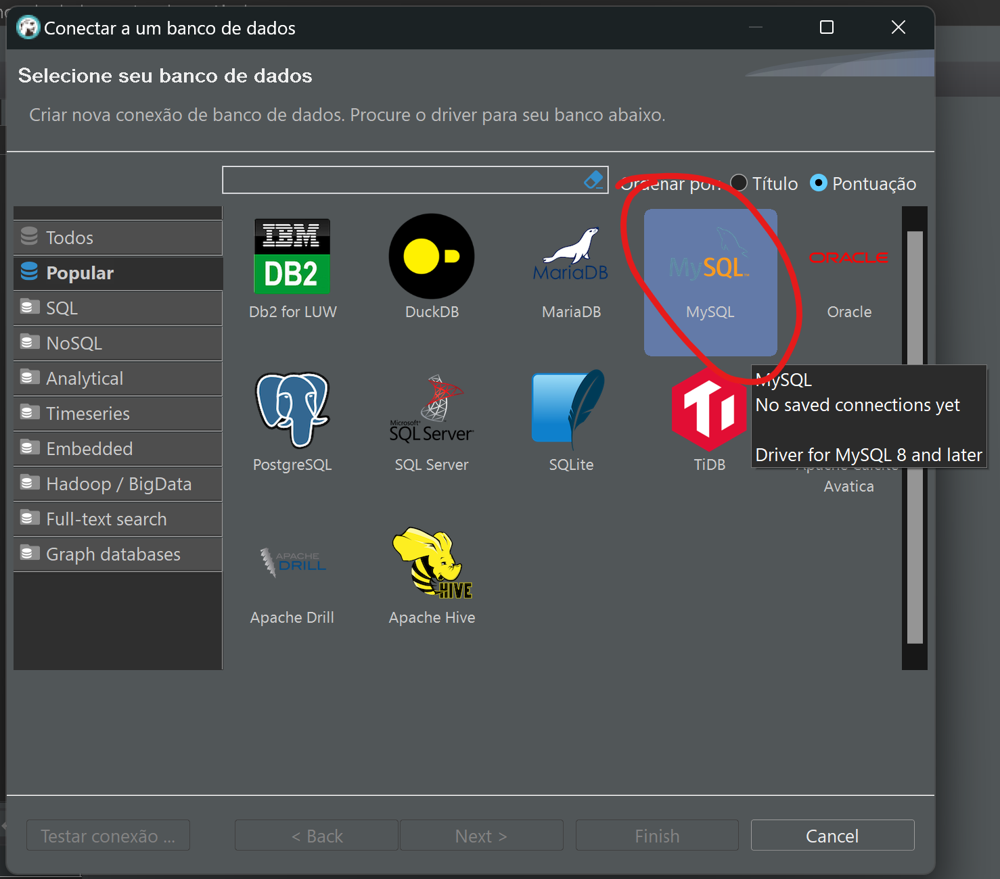
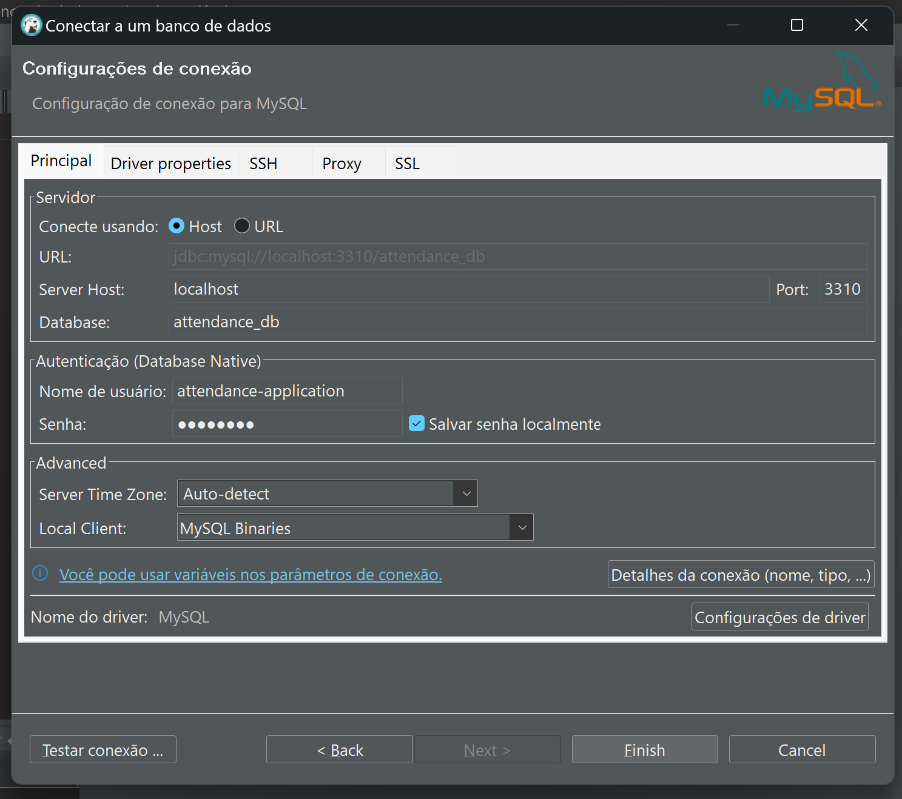

#DataBase

This project is using Mysql database.
Its necessary to have this database installed on you local machine to use it.

1 - Installation:
The installation of MySql will change according your OS or installation method.

We recomendo you to access https://www.mysql.com/downloads/ to see the installation options.

2 - Setup Users:
After install you data base, it's necessary to configure the users:
on terminal type:

`
mysql -u root -p 
`
it will ask you add a new password on the first acess.

After setting your password, let's create a user for the application. Type on mysql terminal:
As it's just a educational project, we will leave the password as 'password'
`
CREATE USER 'attendance-application'@'localhost' IDENTIFIED BY 'LaSalleCollege2023!';
`
We will also grant full access to this user.
`
GRANT ALL PRIVILEGES ON attendance_db.* TO 'attendance-application'@'localhost' WITH GRANT OPTION;
`
Now, let's update the access:
`
FLUSH PRIVILEGES;
`
Now, create the database:

`
create database attendance_db
`

3 - Setup Database:
To create the database, you can use any database manager(compatible with MySql), we are going to use "DBEAVER".

Select "MySql":

After informing all the fields, you can "test coection"
